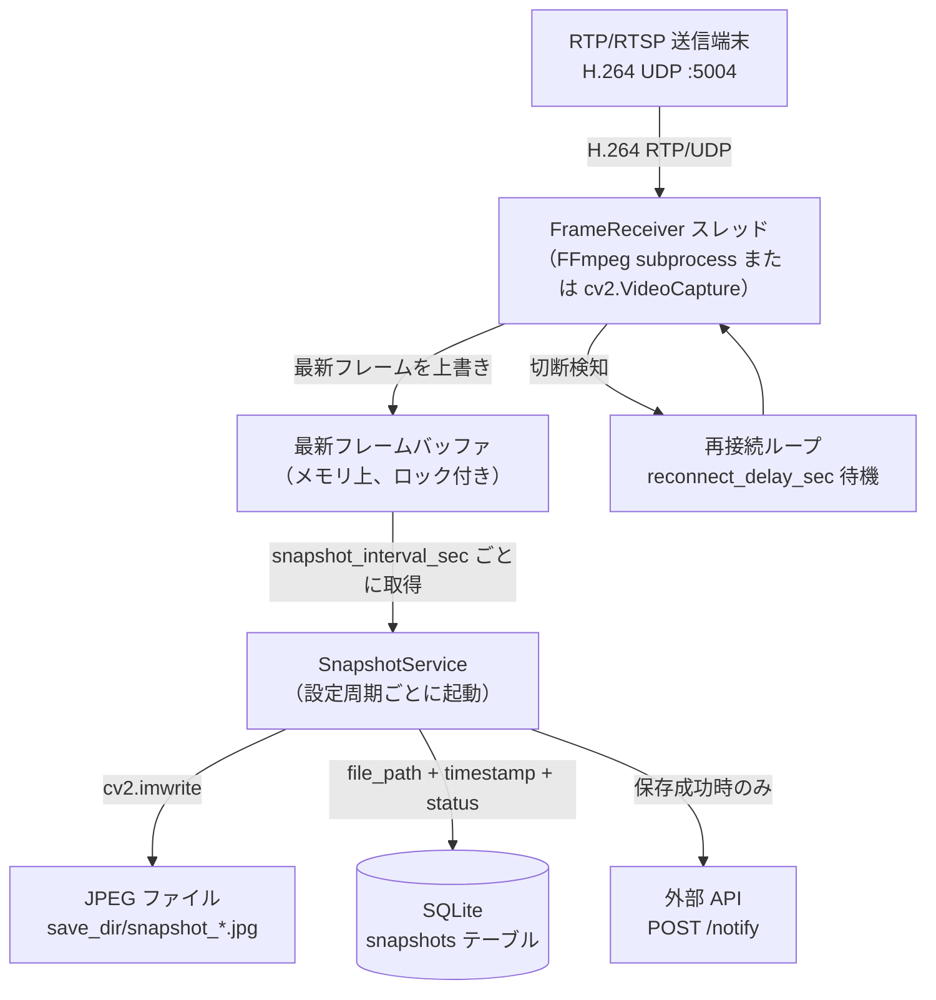

# rtsp-snapshot-processor

[](https://www.python.org/)
[](https://opencv.org/)
[](https://www.sqlite.org/)
[](https://docs.pytest.org/)
[](https://www.mkdocs.org/)
[](https://gstreamer.freedesktop.org/)

RTP/RTSPビデオストリームを低遅延で受信し、指定した周期でスナップショット（JPEG）を保存し、ファイルパスとタイムスタンプをSQLiteへ記録するPythonアプリケーションです。

## データフロー



## 特徴

- **マルチスレッド設計**: 受信スレッドと保存処理を分離し、バッファ遅延を抑えます。
- **複数受信バックエンド**: `rtp`（FFmpeg）/ `gstreamer` / `opencv` / `auto` を切り替えられます。
- **自動初期化**: スナップショット保存先と SQLite DB は初回実行時に自動生成されます。
- **拡張しやすいクラス設計**: 将来的な GPU デコードや AI 推論を載せやすい責務分離構成です。

## 前提条件

### 共通

| 要件 | バージョン | 用途 |
| --- | --- | --- |
| Python | 3.10 以上 | ランタイム |
| FFmpeg | 任意の安定版 | `capture_backend=rtp` で H.264 RTP/UDP 受信 |

### Windows 11（本番）

- Python 3.10 以上（`py` ランチャー推奨）
- Windows 版 FFmpeg。`ffmpeg.exe` を PATH に追加
- UDP `5004` を Windows Firewall で許可（RTP 受信時）

```powershell
python --version
ffmpeg -version
```

### Linux（ネイティブ運用 / Docker）

- Python 3.10 以上
- FFmpeg（`apt install ffmpeg`）
- GStreamer バックエンドを使う場合は distro 版 `python3-opencv`（pip 版は GStreamer 無効ビルドの場合あり）
- Docker 運用時は Docker Engine と Docker Compose

```bash
python3 --version
ffmpeg -version
```

## 実行環境構築手順

### 1. リポジトリをクローン

```bash
git clone https://github.com/tinayla696/rtsp-snapshot-processor.git
cd rtsp-snapshot-processor
```

### 2. 仮想環境を作成して依存関係をインストール

**Linux / macOS**

```bash
python3 -m venv .venv
source .venv/bin/activate
pip install --upgrade pip
pip install -r requirements.txt
```

**Windows（PowerShell）**

```powershell
py -3.12 -m venv .venv
.\.venv\Scripts\Activate.ps1
python -m pip install --upgrade pip
python -m pip install -r requirements.txt
```

### 3. 設定ファイルを準備

```bash
cp stream_processor.toml.example stream_processor.toml
```

`stream_processor.toml` を環境に合わせて編集します。最低限変更が必要な項目:

| キー | 説明 |
| --- | --- |
| `save_dir` | JPEG の保存先ディレクトリ |
| `db_path` | SQLite DB の保存先 |
| `notification_url` | スナップショット保存成功時の通知先 API URL |
| `rtp_port` / `rtp_width` / `rtp_height` | RTP 受信設定 |

設定項目の全一覧は [使用方法](docs/usage.md) を参照してください。

## クイックスタート

```bash
# 設定ファイルを指定して起動
python src/stream_processor.py --config stream_processor.toml

# CLI 引数で一時的に上書きする例（設定ファイルより優先）
python src/stream_processor.py --config stream_processor.toml \
  --capture-backend rtp \
  --snapshot-interval 10
```

停止は `Ctrl+C` です。

### Docker Compose で起動（テスト環境）

```bash
docker compose up -d --build
docker compose logs -f app
```

テスト API サービスも含めて起動する場合:

```bash
docker compose --profile test up -d --build
```

停止:

```bash
docker compose down
```

## サービスファイル化（Linux systemd）

Linux でネイティブ常時稼働させる場合は systemd ユニットファイルを使います。

### 1. ユニットファイルを作成

```bash
sudo nano /etc/systemd/system/rtsp-snapshot-processor.service
```

```ini
[Unit]
Description=RTSP Snapshot Processor
After=network.target

[Service]
Type=simple
User=<実行ユーザー>
WorkingDirectory=/opt/rtsp-snapshot-processor
ExecStart=/opt/rtsp-snapshot-processor/.venv/bin/python src/stream_processor.py --config stream_processor.toml
Restart=on-failure
RestartSec=5
StandardOutput=journal
StandardError=journal

[Install]
WantedBy=multi-user.target
```

`User` と `WorkingDirectory` はデプロイ先のパスに合わせて変更してください。

### 2. 有効化して起動

```bash
sudo systemctl daemon-reload
sudo systemctl enable rtsp-snapshot-processor
sudo systemctl start rtsp-snapshot-processor
```

### 3. 状態確認とログ

```bash
sudo systemctl status rtsp-snapshot-processor
journalctl -u rtsp-snapshot-processor -f
```

## 出力

| 出力 | 場所 | 形式 |
| --- | --- | --- |
| スナップショット | `save_dir/snapshot_YYYYMMDD_HHmmss_mmm.jpg` | JPEG |
| 記録 DB | `db_path` | SQLite（`snapshots` テーブル） |
| 通知 | `notification_url` へ POST | JSON |

SQLite の `snapshots` テーブル構造:

| カラム | 型 | 内容 |
| --- | --- | --- |
| `id` | INTEGER | 自動採番 |
| `file_path` | TEXT | JPEG 絶対パス |
| `timestamp` | TEXT | `YYYY-MM-DD HH:MM:SS.SSS` |
| `status` | INTEGER | `1`=保存成功、`0`=保存失敗 |

> アプリ起動時に DB はリセット（削除・再作成）されます。前回起動分の履歴は保持されません。

## ドキュメント

詳細な設計・開発資料は MkDocs で管理しています。

| ドキュメント | 内容 |
| --- | --- |
| [アーキテクチャ](docs/architecture.md) | クラス設計、スレッドモデル、処理フロー |
| [デプロイと運用](docs/deployment.md) | Windows / Linux / Docker の環境構築と本番設定 |
| [使用方法](docs/usage.md) | 設定項目全一覧、CLI 引数、実行例 |
| [テスト](docs/testing.md) | テスト実行方法、テスト構造、CI 方針 |
| [外部 API 仕様](docs/api-spec.md) | 通知 API のリクエスト・レスポンス仕様 |
| [AI ガイドライン](docs/ai_guidelines.md) | AI エージェント向け設計制約 |

### GitHub Pages

`main` への push 時に GitHub Actions で MkDocs をビルドし、GitHub Pages へ自動デプロイします。

- 公開 URL: https://tinayla696.github.io/rtsp-snapshot-processor/
- 設定: `Settings > Pages > Source` を `GitHub Actions` に変更してください。

## ディレクトリ構成

```text
rtsp-snapshot-processor/
├── docs/                        # MkDocs 開発設計資料
├── src/
│   └── stream_processor.py      # メインアプリケーション
├── tests/
│   └── test_stream_processor.py
├── docker/
│   └── test_api_server.py       # テスト用 API サーバー
├── docker-data/                 # Docker 実行時の出力先
├── docker-compose.yml
├── Dockerfile
├── requirements.txt
├── stream_processor.toml.example
└── README.md
```
