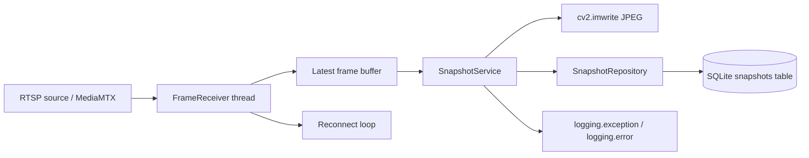

# アーキテクチャ

## 対象とする実行環境

本システムは、Windows 11 上の高性能エッジ端末での長期稼働を前提に設計しています。
特に、Intel Core Ultra 9 と NVIDIA GeForce RTX 5080 のような余力の大きい環境では、
CPU/GPU の将来拡張を阻害しないように、受信処理と保存処理の責務を分離しています。

重要なのは「単純に高速であること」ではなく、「ストリーム断・ディスク障害・設定ミスが起きても
処理全体を落とさずに復旧しやすいこと」です。

## 設計方針

- 受信と保存を分離し、映像受信の詰まりが保存系に波及しにくい構成にする。
- SQLite の失敗をアプリ全体のクラッシュ要因にしない。
- 将来の GPU デコードや AI 推論を追加しても、既存の責務境界を壊さない。
- Python 3.10 互換性を維持し、実運用環境の差分を吸収しやすくする。

## クラス構成

### `AppConfig`

起動設定をまとめる不変データです。`rtsp_url`、保存先、DB パス、スナップショット周期、
`capture_backend`、GStreamer パイプラインテンプレートなど、実行時の制約を1か所に集約します。

### `SnapshotRepository`

SQLite の接続と `snapshots` テーブルの作成・更新を担当します。
`status` 列を含めた記録を保存し、初回起動時に DB ファイルと親ディレクトリを自動生成します。
DB 接続にはロックを掛け、書き込みとクローズの競合を防ぎます。

### `FrameReceiver`

映像受信専用のスレッドを持ち、最新フレームだけをメモリ上に保持します。
`capture_backend` が `auto` の場合は GStreamer を優先し、失敗時に OpenCV 側へフォールバックします。
ここでフレームを溜め込まないのは、遅延増大を防ぐためです。

### `SnapshotService`

メイン側の周期処理として、最新フレームを JPEG に保存し、その結果を SQLite に書き込みます。
保存失敗時は `status=False` として DB に残し、成功時は `status=True` を記録します。
この設計により、「画像は失敗したが、失敗ログは残る」という運用が可能になります。

### `StreamProcessorApplication`

起動、シグナル処理、停止、後始末を束ねるオーケストレータです。
`Ctrl+C` と `SIGTERM` を受けて停止イベントを立て、受信スレッドと DB 接続を順に解放します。

## 処理フロー

## マルチスレッド構成の目的

- 受信側の遅延を保存側から切り離す。
- 保存失敗や DB ロックで受信スレッドを止めない。
- 最新フレームだけを採用し、古いフレームの滞留を防ぐ。

## 耐障害性

- `SnapshotService.run()` は保存処理を `try-except` で囲み、例外が起きても次周期へ進みます。
- `SnapshotRepository` はロック付きで書き込み、同時クローズの競合を抑えます。
- 設定読み込み失敗は明確なエラーメッセージに変換し、原因を追跡しやすくします。

## 制約

- `tomllib` は Python 3.11 以降ですが、このリポジトリは `tomli` フォールバックで Python 3.10 を支えます。
- GStreamer は環境依存です。OpenCV のビルドに GStreamer サポートが無ければ、`capture_backend=gstreamer` は使えません。
- SQLite は高頻度の並列書き込み向きではありません。ここでは単一接続・単一書き込み経路に寄せています。