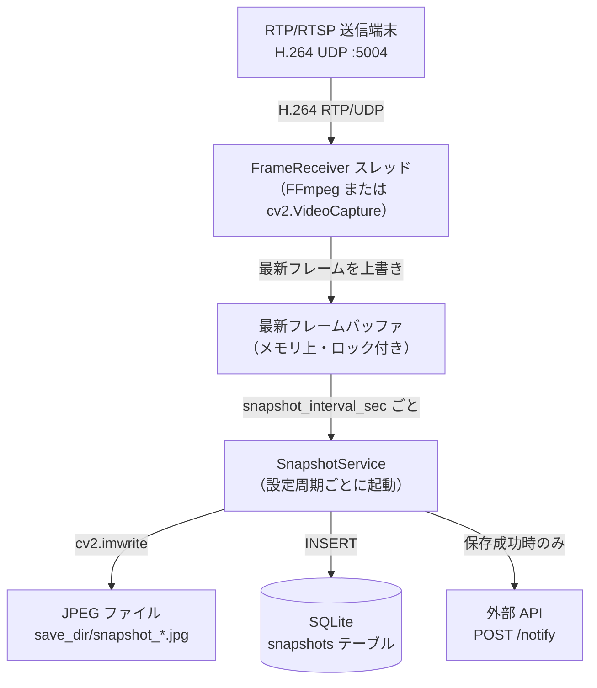

# rtsp-snapshot-processor — Developer Guide

RTP/RTSP 配信を受信して、一定周期で最新フレームを JPEG として保存し、保存履歴を SQLite に記録するアプリケーションです。本ドキュメントサイトは **開発設計資料 + Developer ガイド** として機能します。

## システム概要



## できること

- 低遅延を意識した受信スレッド分離（受信と保存の責務を完全分離）
- `rtp` / `gstreamer` / `opencv` / `auto` の受信バックエンド切り替え
- GStreamer 優先・OpenCV フォールバックの自動選択（`auto`）
- 周期スナップショット保存（JPEG）
- SQLite への絶対パス・タイムスタンプ・ステータス登録
- 初回実行時の保存先ディレクトリと DB の自動生成
- TOML 設定ファイルと CLI 引数による起動設定（CLI 優先）
- スナップショット保存成功時の外部 API 通知

## 実行環境

| 環境 | 方式 | 用途 |
| --- | --- | --- |
| Windows 11 | Python + Windows版FFmpeg | 本番稼働 |
| Linux | Python + FFmpeg + systemd | ネイティブ本番・検証 |
| Docker Compose | コンテナ + test-api | 結合テスト・CI |

## ドキュメント構成

| ページ | 内容 |
| --- | --- |
| [アーキテクチャ](architecture.md) | クラス設計、スレッドモデル、受信バックエンド詳細、耐障害性 |
| [デプロイと運用](deployment.md) | Windows / Linux(systemd) / Docker の環境構築と本番設定 |
| [使用方法](usage.md) | 設定項目全一覧、CLI 引数、RTP 実機接続手順 |
| [テスト](testing.md) | テスト実行方法、テスト構造、モック戦略、CI 方針 |
| [外部 API 仕様](api-spec.md) | 通知 API のリクエスト・レスポンス仕様、セキュリティ要件 |
| [AI ガイドライン](ai_guidelines.md) | AI エージェント向け設計制約・ルール |

## 最小構成

```text
src/stream_processor.py   # メインアプリケーション
requirements.txt          # 依存関係
tests/                    # pytest テストスイート
stream_processor.toml     # 実行時設定（.example からコピー）
```

## クイックリンク

- [設定ファイルの全項目 →](usage.md#設定項目)
- [受信バックエンドの選択 →](architecture.md#受信バックエンド選択ロジック)
- [Windows 本番セットアップ →](deployment.md#本番環境-windows-11)
- [Linux systemd サービス化 →](deployment.md#linux-ネイティブ運用systemd)
- [Docker Compose 起動 →](deployment.md#テスト環境-docker-compose)
- [テスト実行 →](testing.md#実行方法)